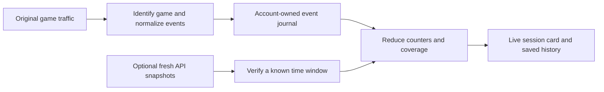

# Sessions without the Hypixel API — proposed design

## Implemented subset (September 15, 2026)

The conservative subset is implemented in `src/session/localTracking.js`. The broader design below remains a proposal; it is not a list of supported counters.

- When Fury's API kill switch is enabled, or no Hypixel API key is configured, the connected Minecraft account can start a session without an API snapshot. This does not infer API availability from unchanged counters or detect Hypixel privacy settings.
- Fully observed games support confirmed wins/losses, completed games, recognized regular kills/deaths, WLR, KDR, win rate and a local winning streak. Standard BedWars additionally supports final kills/deaths, beds broken/lost, FKDR and BBLR. XP/stars remain unavailable. Ratios require both underlying counters and use the existing card convention of dividing by at least one.
- A counter is exposed only while its observation coverage is complete. A missed start, interrupted game or unsupported variant removes incomplete counters from the session total. Unknown own identity removes credited finals/beds; an unknown team prevents beds-lost tracking. An unsupported relevant message removes affected fields. Automatic bed destruction is not translated into a guessed API-style bed statistic.
- Only recognized server messages count. Player chat is excluded, final victims are unique within a standard game, and each team's bed can be credited once. Regular duplicate text within one second is suppressed. Final deaths are separate from regular deaths. VICTORY/DEFEAT establish the result; own-team elimination confirms a BedWars loss. In BedWars, GAME OVER is a loss unless a VICTORY for the same game replaces it; in other modes it only confirms completion. A disconnect never supplies a loss. Duplicate results count once; conflicting results invalidate outcomes.
- Mode counts use the observed queue/duel variant. Missing variants remain Unspecified with partial mode coverage. Match records use the first result timestamp for daily activity, including a later lobby return across midnight. Calendar ratios use summed counters. A local streak counts consecutive confirmed wins in the current local session, resets on a loss, and starts again after unknown coverage. It is not an official lifetime streak, nor a sum of streaks across days or sessions.
- Local totals persist independently of the bounded game list. Recovered unfinished games are marked incomplete. Local history, PNG cards, `/session` and recaps show the available subset. Unsupported fields are absent, not zero. A genuinely observed zero remains zero.
- New data belongs to the authenticated connection's UUID. The launcher selector only chooses which account's history to display. History retention applies separately to each account.
- Switching between API and local tracking closes the current source window and starts a separate session. API lifetime counters cannot become local gains or get added twice. Force-refresh and verification retries do not call the API in local mode.
- Accuracy depends on the server traffic the proxy actually receives. These are conservative observed counters, not a claim that arbitrary server message changes or unobservable server-side filtering can always be detected.

Validation: `npm run test:local-stats`, `npm test`, and `npm run test:calendar`. Tests cover duplicate/conflicting results, final deaths, ratios, streak resets, short Duels, old saves, account isolation, source transitions and midnight allocation. Electron renders and exports cards in an isolated profile. Live Hypixel traffic still depends on supported message formats.

## Original broader proposal (not implemented)

## Behavior

A session begins when the connected Minecraft account starts a supported game, even if the API is disabled, unavailable, or returning stale counters. The session card updates during play from the game traffic already passing through Fury. Saving and exporting the card use those same totals. No per-game overview page is needed.

The selected launcher account controls which history and reminders are displayed. The authenticated account connected to the proxy owns new observations. Switching the launcher selector must never transfer live statistics to a different account.

## What exists today

- `proxy.js` captures structured game events, with basic duplicate detection and game metadata.
- `src/session/gameEvents.js` parses some kill, final-kill, bed and result messages and derives counters.
- `compactGame` in `src/session/launcherSessionHistory.js` can use those events when a game's API delta is missing.
- However, `ensureSession` in `src/session/sessionTracker.js` requires a snapshot to initialize a new session. Session-level card modes are built from API snapshot deltas, not the game's event totals. The existing event capture is therefore only a foundation for this feature.

## Data flow

1. **Create a local session without a snapshot.** Use the connected UUID, supported game mode, start time and existing inactivity policy. Store API baselines separately and permit them to be absent. Track each game with a stable ID and whether Fury observed its start.
2. **Observe original server traffic.** Consume recognized game messages, result titles and scoreboard updates before Fury recolors or rewrites them. Ignore player/party/guild conversation and unsupported message formats. Resolve the player's game identity and team from the connection and roster, including supported nick mappings.
3. **Normalize and deduplicate.** Store game ID, event ID, time, source, actor/victim/team and confidence. Multiple signals for the same kill or result update one observation. A repeated scoreboard value is a snapshot, not another kill. Do not deduplicate distinct kills merely because they involve the same two players.
4. **Persist and reduce.** Append observations to an account-owned journal and derive a materialized session summary. Replay after restart without incrementing counts again. Write small batches with bounded recovery loss; flush at game end and orderly shutdown. Throttle UI refreshes to avoid rendering on every packet.
5. **Finish independently.** Known results settle games locally. A disconnect or return to lobby by itself is not a confirmed loss. A final death does not by itself establish the team's final result. Keep unresolved outcomes and incomplete coverage explicit.

## Statistics and evidence

| Card field | Proposed evidence and rule |
| --- | --- |
| Kills / deaths | Recognized non-final events involving the connected player; include supported deaths with no credited killer. |
| Final kills / final deaths | Recognized final events, kept separate from normal BedWars kills/deaths. |
| Beds broken | A confirmed bed event credited to the connected player. |
| Beds lost | The connected player's team's bed being destroyed, once per game. |
| Wins / losses | Confirmed outcome for the connected player/team, once per game. |
| Games | Distinguish started games from confirmed completed games; use completed games for completion-based rates. |
| WLR / FKDR / KDR / BBLR | Compute from the session's corresponding counters. Do not average per-game ratios. |
| Duration | Local elapsed time with the existing session inactivity policy. |
| XP / stars / assists | Only use a supported, validated source. Otherwise show unavailable; never fabricate a zero or an exact gain. |

When a denominator is genuinely zero and coverage is complete, display infinity for a positive numerator and a dash for 0/0. If the denominator is unknown, the ratio is unknown. Do not silently divide by one.

Start with BedWars and validate its variants independently. SkyWars and Duels should use separate adapters and fixtures, especially where rounds differ from completed matches.

## API reconciliation without double counting

Local observation continues whether the API is enabled or disabled. When disabled, the tracking feature makes no API requests and starts no verification retries.

When enabled, optional fresh snapshots can verify a window with a known baseline, endpoint, account and compatible game mode. A delayed delta covering three games verifies that whole window; it must not be assigned to the last game or added on top of its locally observed counts. Repeated snapshots do not change totals twice.

Store local observations and API evidence separately. Reconcile once per field/window and record the chosen result. If a trustworthy window's API count differs, expose the correction instead of silently combining sources. If its scope is ambiguous—for example play outside the observed connection—retain local counts and mark the comparison unresolved. A first API snapshot taken halfway through a session establishes a baseline for future verification; it cannot verify the earlier unobserved interval.

## Card presentation

Keep the current generated image and full stat selection. Add one quiet status under the date/time:

- **Local tracking · API off** — counters come from observed play.
- **API verified** — the displayed counters were checked over a matching window.
- **Partial tracking** — Fury missed part of the game or encountered unsupported evidence.

Coverage belongs to individual fields, not just the session. A known count can remain visible while a different field shows a dash. When missed events could increase a displayed count, mark it as a lower bound rather than an exact total. A partial ratio should not appear exact. Tooltips in the launcher can explain coverage; exported images need a short visible note because they cannot carry hover text.

## Validation before implementation is considered complete

Replay recorded, sanitized packet fixtures and compare known outcomes with API deltas where available. Cover normal and cosmetic kill messages, void/environment deaths, final deaths followed by team wins, duplicate title/chat results, delayed scoreboards, reconnects, restarts, nicked identity, multiple accounts, unsupported modes, delayed API batches, disabled API and fresh mid-session baselines. Start with observation-only comparison against existing sessions before making local counters the displayed default.

## Why the current card hides ratios

The checked workspace's `features_config.json` currently selects only `wins`, `losses`, `finals`, `beds`, and `fkdr` for BedWars cards. SkyWars and Duels each select `wins`, `losses`, `kills`, and `kdr`. These persisted selections override the broader defaults. The renderer already supports WLR, KDR, FKDR and BBLR where applicable. They can be selected under Settings → Sessions → Session card stats without implementing this proposal.
